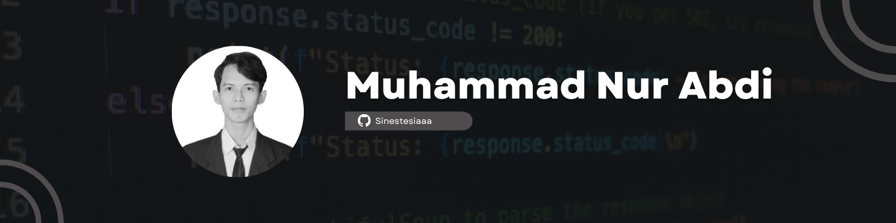

## Hi there 👋


## Welcome to my Github Profile! <br> 
### About me!

```python
class MuhammadNurAbdi:
    def __init__(self):
        self.info = {
            "university": "Universitas Lambung Mangkurat",
            "degree": "Bachelor's in Information Technology",
            "certifications": [
                "Google Data Analytics Professional Certificate",
                "Google Cloud Certified Associate Cloud Engineer",
                "Oracle Certified Foundations Associate, Database"
            ],
            "career_aspiration": "Data Analyst"
        }
        self.skills = ["MySQL", "Python", "Power BI", "Looker Studio", "Tableau"]
        self.tools = ["Pandas", "NumPy", "Matplotlib", "Seaborn", "Scikit-learn"]
        self.interests = ("Data Analytics", "Machine Learning", "Problem Solving","Music")
me = MuhammadNurAbdi()
```

## 📈 GitHub Activity Graph

[](https://github.com/ashutosh00710/github-readme-activity-graph)

<p align="center">
  <a href="https://github.com/Sinestesiaaa#gh-light-mode-only">
    
  </a>
</p>


## 📊 GitHub Stats & Most Used Languages

<table>
  <tr>
    <td>
      
    </td>
    <td>
      
    </td>
  </tr>
</table>

## 🌐 Connect with me  
<p align="left">
  <a href="https://www.linkedin.com/in/muhammad-nur-abdi/" target="_blank"></a>
  <a href="mailto:muhammadnurabdi01@gmail.com" target="_blank"></a>
  <a href="https://www.canva.com/design/DAGeHk4CNR4/l_6BqYQmMiAOTLDDXBhxOw/edit?utm_content=DAGeHk4CNR4&utm_campaign=designshare&utm_medium=link2&utm_source=sharebutton" target="_blank"></a>
</p>
